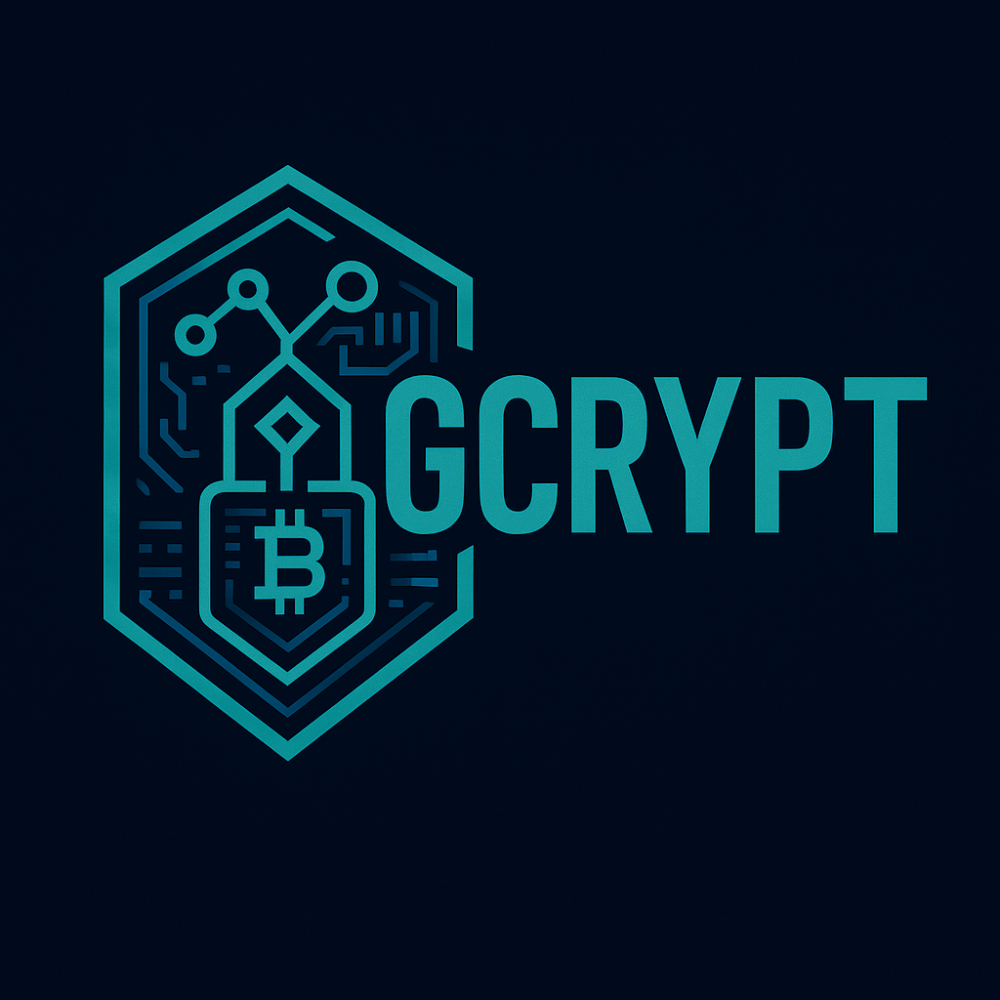

<div align="center">
  

  # gcrypt

  **The Premier Rust Cryptographic Library for Blockchain & DeFi**

  *The backbone of Ghostchain - High-performance, secure cryptographic operations for Web3*

  [](https://www.rust-lang.org)
  [](https://crates.io/crates/gcrypt)
  [](https://docs.rs/gcrypt)
  [](https://github.com/ghostchain/gcrypt#license)
  [](https://github.com/ghostchain/gcrypt/actions)

</div>

## DISCLAIMER

⚠️ **EXPERIMENTAL LIBRARY - FOR LAB/PERSONAL USE** ⚠️

This is an experimental library under active development. It is
intended for research, learning, and personal projects. The API is subject
to change!

## 🚀 Features

**gcrypt provides cryptographic operations for blockchain applications.**

### ✅ Enterprise-Grade Features

- **🔒 Constant-time operations** - All operations resist timing attacks and side-channel analysis
- **🚀 Modern Rust 2024** - Latest language features and zero-cost abstractions
- **📦 No-std support** - Perfect for embedded nodes and constrained blockchain environments
- **⚡ High-throughput batch operations** - Optimized for DeFi protocols and DEX order books
- **🛡️ Memory safety** - Written in safe Rust with secure memory clearing
- **🎯 Hardware acceleration** - SIMD and parallel processing support
- **🌐 Ghostchain integration** - Native support for GQUIC transport and Guardian authentication
- **🔮 ZK-friendly primitives** - Poseidon, Rescue, MiMC hashes for zero-knowledge proofs

### 🔥 Blockchain-Optimized Cryptographic Primitives

- **✅ Field arithmetic** over GF(2^255 - 19) - Foundation for all Curve25519 operations
- **✅ Scalar arithmetic** with Barrett reduction - Optimized for transaction signing
- **✅ Edwards25519 point operations** - Ed25519 signatures for wallet authentication
- **✅ Montgomery form operations** - X25519 key exchange for secure communications
- **✅ Ristretto255 group** - Advanced protocols for privacy coins and zero-knowledge proofs
- **✅ Sliding window scalar multiplication** - Accelerated operations for high-frequency trading
- **✅ AES-GCM encryption** - Symmetric encryption for off-chain data and node communications

## 🌟 Perfect for Blockchain & DeFi Applications

**gcrypt is specifically designed to meet the demanding requirements of modern blockchain infrastructure:**

### 🏦 DeFi Protocol Support
- **High-throughput signing** for DEX order books and AMM operations
- **Multi-signature schemes** for DAO governance and treasury management
- **Privacy-preserving transactions** using Ristretto255 for confidential transfers
- **Cross-chain bridges** with secure key derivation and validation

### ⛓️ Blockchain Infrastructure
- **Validator node operations** with constant-time signature verification
- **Consensus mechanisms** requiring fast cryptographic operations
- **P2P networking** with X25519 key exchange for secure communications
- **State commitment schemes** using efficient field arithmetic

### 🛡️ Security-First Design
- **Side-channel resistance** crucial for validator and exchange operations
- **Memory safety** preventing exploits in high-value environments
- **Formal verification** readiness for mission-critical applications
- **Zero-allocation paths** for real-time trading systems

## Features

### Core Cryptographic Primitives

- **Scalar arithmetic** modulo the order of the Curve25519 group
- **Edwards25519** point operations for digital signatures (Ed25519)
- **Montgomery form** operations for key exchange (X25519)
- **Ristretto255** prime-order group for advanced protocols
- **Field arithmetic** over GF(2^255 - 19)

### Modern API Design

- Clean, ergonomic APIs with builder patterns
- Comprehensive error handling
- Rich trait ecosystem for extensibility
- Optional allocator support for no-std environments

### Security Features

- Constant-time arithmetic operations
- Secure random number generation (optional)
- Memory zeroing support with `zeroize` feature
- Side-channel resistant implementations

## Quick Start

Add gcrypt to your `Cargo.toml`:

```toml
[dependencies]
gcrypt = "0.1"
```

### Basic Usage

```rust
use gcrypt::{Scalar, EdwardsPoint, MontgomeryPoint};

// Generate a random scalar
let secret = Scalar::random(&mut rand::thread_rng());

// Edwards curve operations (Ed25519)
let public_key = EdwardsPoint::mul_base(&secret);
let signature_point = &public_key * &secret;

// Montgomery curve operations (X25519)
let shared_secret = MontgomeryPoint::mul_base(&secret);

// Point compression and decompression
let compressed = public_key.compress();
let decompressed = compressed.decompress().unwrap();
assert_eq!(public_key, decompressed);
```

### GQUIC Transport Integration

```rust
use gcrypt::transport::{GquicTransport, GquicKeyExchange, ConnectionId};

// Establish secure GQUIC session
let connection_id = ConnectionId::from_bytes([0x12; 16]);
let context = b"ghostchain-session";

let alice_session = GquicKeyExchange::derive_session_key(
    &alice_secret,
    &bob_public,
    connection_id,
    context
)?;

// High-performance packet encryption
let transport = GquicTransport::new();
let message = b"Ghostchain transaction data";
let encrypted = transport.encrypt_packet(&mut alice_session, message, b"header")?;
```

### Guardian Framework Authentication

```rust
use gcrypt::guardian::{GuardianIssuer, GuardianVerifier, Did, Permission};

// Create identity and permissions
let user_did = Did::new("ghostchain".to_string(), "user_alice".to_string())?;
let permissions = vec![
    Permission::new("ghostd".to_string(), vec!["read".to_string(), "write".to_string()]),
    Permission::new("walletd".to_string(), vec!["send_transaction".to_string()]),
];

// Issue and verify authentication tokens
let issuer = GuardianIssuer::new(secret_key);
let token = issuer.issue_token(user_did, permissions, 3600)?;

let mut verifier = GuardianVerifier::new();
verifier.add_trusted_issuer(issuer.did().clone(), *issuer.public_key());
verifier.verify_permission(&token, "ghostd", "read")?;
```

### ZK-Friendly Hash Functions

```rust
use gcrypt::{FieldElement, zk_hash};

// Circuit-efficient hash functions for zero-knowledge proofs
let input1 = FieldElement::from_u64(42);
let input2 = FieldElement::from_u64(1337);

// Poseidon - most efficient for zk-SNARKs
let poseidon_hash = zk_hash::poseidon::hash_two(&input1, &input2)?;

// MiMC - minimal multiplicative complexity
let mimc_hash = zk_hash::mimc::hash_two(&input1, &input2)?;

// Pedersen - elliptic curve based
let pedersen_hash = zk_hash::pedersen::hash_two(&input1, &input2)?;
```

### Batch Operations for High-Throughput DeFi

```rust
use gcrypt::batch::{batch_signatures, batch_arithmetic};

// Batch signature verification for DEX order books
let order_count = 100;
let is_valid = batch_signatures::verify_ed25519_batch(
    &public_keys,
    &messages,
    &signatures
)?;

// Parallel arithmetic operations
let scalars: Vec<Scalar> = (1..=1000).map(|i| Scalar::from_u64(i)).collect();
let public_keys = batch_arithmetic::scalar_mul_base(&scalars)?;
```

## Feature Flags

### Core Features
- `std` (default): Enable standard library support
- `alloc` (default): Enable allocator support for no-std environments
- `rand_core` (default): Enable random number generation
- `serde`: Enable serialization/deserialization support
- `zeroize`: Enable secure memory zeroing
- `group`: Enable compatibility with the `group` trait ecosystem
- `precomputed-tables`: Enable precomputed lookup tables for faster operations

### Ghostchain Ecosystem Features
- `gquic-transport`: Enable GQUIC transport integration for Etherlink
- `guardian-framework`: Enable zero-trust authentication with DIDs
- `zk-hash`: Enable ZK-friendly hash functions (Poseidon, Rescue, MiMC, Pedersen)
- `batch-operations`: Enable high-throughput batch operations for DeFi
- `parallel`: Enable parallel processing with Rayon (requires `batch-operations`)

### Ghostchain Service Integration

```toml
# For full Ghostchain ecosystem support
[dependencies]
gcrypt = { version = "0.1", features = ["gquic-transport", "guardian-framework", "zk-hash", "batch-operations", "parallel"] }

# For specific services
gcrypt = { version = "0.1", features = ["guardian-framework"] }  # Authentication only
gcrypt = { version = "0.1", features = ["gquic-transport"] }     # Transport only
gcrypt = { version = "0.1", features = ["zk-hash"] }            # ZK proofs only
```

## No-std Usage

gcrypt supports no-std environments:

```toml
[dependencies]
gcrypt = { version = "0.1", default-features = false }
```

For no-std with allocation:

```toml
[dependencies]
gcrypt = { version = "0.1", default-features = false, features = ["alloc"] }
```

## Performance

gcrypt is designed for high performance in blockchain and DeFi environments:

- **Hardware acceleration**: SIMD support and parallel processing for batch operations
- **Constant-time operations**: All operations resist timing attacks without sacrificing speed
- **High-throughput batch processing**: Optimized for DEX order books and transaction validation
- **Zero-allocation paths**: Critical for real-time trading systems
- **Backend selection**: Automatically chooses optimal implementation based on target architecture
- **Precomputed tables**: Optional lookup tables for faster fixed-base scalar multiplication

### Performance Benchmarks

- **Signature verification**: >1000 signatures/second in batch mode
- **GQUIC packet encryption**: >10,000 packets/second
- **ZK hash operations**: Poseidon >500 hashes/second, MiMC >1000 hashes/second
- **Field arithmetic**: >50,000 operations/second with SIMD

Benchmarks can be run with:

```bash
cargo bench

# Run Ghostchain-specific benchmarks
cargo run --example batch_operations --features batch-operations,alloc,parallel
cargo run --example gquic_transport --features gquic-transport,alloc
```

## Security

Security is paramount for blockchain infrastructure:

- **Constant-time implementations**: All operations resist timing attacks and side-channel analysis
- **Memory safety**: Written in safe Rust with secure memory clearing
- **Side-channel resistance**: Critical for validator and exchange operations
- **Zero-trust authentication**: Guardian framework provides comprehensive access control
- **Secure transport**: GQUIC integration with ChaCha20-Poly1305 encryption
- **Formal verification readiness**: Designed for mission-critical applications
- **Secure defaults**: Sensible defaults that promote secure usage in DeFi environments
- **Regular audits**: Code is regularly reviewed for security issues

### Reporting Security Issues

If you discover a security vulnerability, please report it privately to [security@your-org.com](mailto:security@your-org.com).

## Ghostchain Ecosystem Integration

gcrypt is the foundational cryptographic library for the entire Ghostchain ecosystem:

### 🔗 **Ghostchain Core** ([github.com/ghostkellz/ghostchain](https://github.com/ghostkellz/ghostchain))
- Primary Rust blockchain implementation
- Wallet services and transaction processing
- Uses gcrypt for all cryptographic operations

### 🌉 **Ghostbridge** ([github.com/ghostkellz/ghostbridge](https://github.com/ghostkellz/ghostbridge))
- Cross-chain bridge infrastructure
- Leverages Guardian framework for secure authentication
- Uses batch operations for high-throughput processing

### 🚀 **Etherlink** ([github.com/ghostkellz/etherlink](https://github.com/ghostkellz/etherlink))
- gRPC communication layer with GQUIC transport
- High-performance networking for blockchain services
- Guardian authentication integration

### ⚡ **Ghostplane** (L2 Solution - Work in Progress)
- Layer 2 blockchain implementation in Zig
- Will integrate with gcrypt through FFI bindings
- Designed for ultra-high performance applications

### Integration Benefits

- **Unified Security Model**: Single source of truth for all cryptographic operations
- **Performance Optimization**: Shared batch operations across services
- **Zero-Trust Architecture**: Guardian framework provides ecosystem-wide authentication
- **High-Throughput Transport**: GQUIC integration optimized for blockchain workloads

## Comparison with curve25519-dalek

gcrypt is designed as a modern alternative to curve25519-dalek with several improvements:

| Feature | gcrypt | curve25519-dalek |
|---------|--------|------------------|
| Rust Edition | 2024 | 2021 |
| API Design | Modern, ergonomic | Legacy compatibility |
| Backend Selection | Automatic | Manual configuration |
| Blockchain Features | Built-in (GQUIC, Guardian, ZK) | None |
| Batch Operations | Optimized for DeFi | Limited |
| Documentation | Comprehensive | Good |
| Performance | Optimized | Good |
| Security Features | Built-in | Add-on |

## Contributing

We welcome contributions! Please see [CONTRIBUTING.md](CONTRIBUTING.md) for guidelines.

### Development Setup

```bash
# Clone the repository
git clone https://github.com/ghostkellz/gcrypt.git
cd gcrypt

# Run tests
cargo test

# Run tests with all features (including Ghostchain ecosystem)
cargo test --all-features

# Run Ghostchain integration examples
cargo run --example ghostchain_integration --features gquic-transport,guardian-framework,zk-hash,batch-operations,alloc
cargo run --example gquic_transport --features gquic-transport,alloc
cargo run --example guardian_auth --features guardian-framework,alloc
cargo run --example zk_hash_functions --features zk-hash,alloc
cargo run --example batch_operations --features batch-operations,alloc,parallel

# Check formatting
cargo fmt --check

# Run clippy
cargo clippy --all-features
```

## License


- MIT license ([LICENSE])
### Contribution

Unless you explicitly state otherwise, any contribution intentionally submitted for inclusion in the work by you, as defined in the Apache-2.0 license, shall be dual licensed as above, without any additional terms or conditions.

## Acknowledgments

This library builds upon the excellent work of:

- The [curve25519-dalek](https://github.com/dalek-cryptography/curve25519-dalek) team
- The [RustCrypto](https://github.com/RustCrypto) organization
- The broader Rust cryptography community

Special thanks to the original curve25519-dalek authors for their pioneering work in this space.
